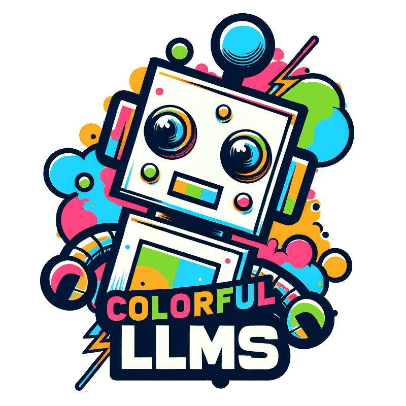

<h1 align="center" class="ui-bar-a">  Colorful Multimodal Research</h1>

    

Welcome to our meticulously assembled anthology of vibrant multimodal research, encompassing an array of domains including **Vision**, **Audio**, **Agent**, **Robotics**, and **Fundamental Sciences** such as Mathematics. Our collection primarily focuses on the advancements propelled by **large language models (LLMs)**, complemented by an assortment of related collections.

## Table of Contents

- [👀 Vision](#-vision)
  - [Image](#-image)
  - [Video](#-video)
  - [3D](#-3d)
  - [Document](#-documnent)
- [👂 Audio](#-audio)
- [🔧 Agent](#-agent)
- [🤖 Robotic](#-robotic)
- [🔬 Science](#-science)
  - [Math](#%EF%B8%8F-ai-for-math)
- [🙌 Contributing](#contributing)

## 👀 Vision

### 🖼 Image

Collection of works about Image + LLMs, Diffusion, see [Image](Vision/Image.md) for details

> - Image Understanding
>   - Reading List
>   - Datasets & Benchmarks
> - Image Generation
>   - Reading List
> - Open-source Projects

Related Collections (Understanding)

- [VLM_survey](https://github.com/jingyi0000/VLM_survey) , This is the repository of "Vision Language Models for Vision Tasks: a Survey", a systematic survey of VLM studies in various visual recognition tasks including image classification, object detection, semantic segmentation, etc.
- [Awesome-Multimodal-Large-Language-Models](https://github.com/BradyFU/Awesome-Multimodal-Large-Language-Models) , A curated list of Multimodal Large Language Models (MLLMs), including datasets, multimodal instruction tuning, multimodal in-context learning, multimodal chain-of-thought, llm-aided visual reasoning, foundation models, and others. This list will be updated in real time.
- [LLM-in-Vision](https://github.com/DirtyHarryLYL/LLM-in-Vision) , Recent LLM (Large Language Models)-based CV and multi-modal works
- [Awesome-Transformer-Attention](https://github.com/cmhungsteve/Awesome-Transformer-Attention) , This repo contains a comprehensive paper list of Vision Transformer & Attention, including papers, codes, and related websites
- [Multimodal-AND-Large-Language-Models](https://github.com/Yangyi-Chen/Multimodal-AND-Large-Language-Models) , Paper list about multimodal and large language models, only used to record papers I read in the daily arxiv for personal needs.
- [Awesome-Vision-and-Language](https://github.com/sangminwoo/awesome-vision-and-language) , A curated list of awesome vision and language resources
- [Awesome-Multimodal-Research](https://github.com/Eurus-Holmes/Awesome-Multimodal-Research) , This repo is reorganized from Awesome-Multimodal-ML
- [Awesome-Multimodal-ML](https://github.com/pliang279/awesome-multimodal-ml) , Reading list for research topics in multimodal machine learning

Related Collections (Generation)

- [Awesome-VQVAE](https://github.com/rese1f/Awesome-VQVAE) , A collection of resources and papers on Vector Quantized Variational Autoencoder (VQ-VAE) and its application
- [Awesome-Diffusion-Models](https://github.com/heejkoo/Awesome-Diffusion-Models) , This repository contains a collection of resources and papers on Diffusion Models

Tutorials

- [CVPR2023 Tutorial] [Recent Advances in Vision Foundation Models](https://vlp-tutorial.github.io/)
- [CVPR2022 Tutorial] [Recent Advances in Vision-and-Language Pre-training](https://vlp-tutorial.github.io/)

### 📺 Video

Collection of works about Video-Language Pretraining, Video + LLMs, see [Video](Vision/Video.md) for details

> - Video Understanding
>   - Reading List
>   - Pretraining Tasks
>   - Datasets
>     - Pretraining Corpora
>     - Video Instructions
>   - Benchmarks
>     - Common Downstream Tasks
>     - Advanced Downstream Tasks
> - Video Understanding
>   - Reading List

Related Collections (datasets)

- [Awesome-Video-Datasets](https://github.com/xiaobai1217/Awesome-Video-Datasets#Video-and-Language) 

Related Collections (understanding)

- [Awesome-LLMs-for-Video-Understanding](https://github.com/yunlong10/Awesome-LLMs-for-Video-Understanding) , Latest Papers, Codes and Datasets on Vid-LLMs.

Related Collections (generation)

- [i2vgen-xl](https://github.com/damo-vilab/i2vgen-xl) , VGen is an open-source video synthesis codebase developed by the Tongyi Lab of Alibaba Group, featuring state-of-the-art video generative models.

### 📷 3D

Collection of works about 3D+LLM, see [3D](Vision/3D.md) for details

> - Reading List

Related Collections

- [awesome-3D-gaussian-splatting](https://github.com/MrNeRF/awesome-3D-gaussian-splatting) , A curated list of papers and open-source resources focused on 3D Gaussian Splatting, intended to keep pace with the anticipated surge of research in the coming months
- [Awesome-LLM-3D](https://github.com/ActiveVisionLab/Awesome-LLM-3D) , a curated list of Multi-modal Large Language Model in 3D world Resources
- [Awesome-3D-Vision-and-Language](https://github.com/jianghaojun/Awesome-3D-Vision-and-Language) , A curated list of research papers in 3D visual grounding

### 📰 Documnent

Related Collections

- [Awesome Document Understanding](https://github.com/tstanislawek/awesome-document-understanding) , A curated list of resources for Document Understanding (DU) topic related to Intelligent Document Processing (IDP), which is relative to Robotic Process Automation (RPA) from unstructured data, especially form Visually Rich Documents (VRDs).

## 👂 Audio

Collection of works about audio+LLM, see [Audio](Audio/Audio.md) for details

> - Reading List

Related Collections

- [Audio-AI-Timeline](https://github.com/archinetai/audio-ai-timeline) , Here we will keep track of the latest AI models for waveform based audio generation, starting in 2023!

## 🔧 Agent

Collection of works about agent learning, see [Agent](Agents/Agent.md) for details

> - Reading List
> - Datasets & Benchmarks
> - Projects
> - Applications

Related Collections

- [LLM-Agent-Paper-Digest](https://github.com/XueyangFeng/LLM-Agent-Paper-Digest) , For benefiting the research community and promoting LLM-powered agent direction, we organize papers related to LLM-powered agent that published on top conferences recently
- [LLMAgentPapers](https://github.com/zjunlp/LLMAgentPapers) , Must-read Papers on Large Language Model Agents.
- [LLM-Agent-Paper-List](https://github.com/WooooDyy/LLM-Agent-Paper-List) , In this repository, we provide a systematic and comprehensive survey on LLM-based agents, and list some must-read papers.
- [XLang Paper Reading](https://github.com/xlang-ai/xlang-paper-reading) , Paper collection on building and evaluating language model agents via executable language grounding
- [Awesome-LLMOps](https://github.com/tensorchord/Awesome-LLMOps) , An awesome & curated list of best LLMOps tools for developers
- [Awesome LLM-Powered Agent](https://github.com/hyp1231/awesome-llm-powered-agent) , Awesome things about LLM-powered agents. Papers / Repos / Blogs / ...
- [Awesome-Embodied-AI](https://github.com/haoranD/Awesome-Embodied-AI) , A curated list of awesome papers on Embodied AI and related research/industry-driven resources
- [ToolLearningPapers](https://github.com/thunlp/ToolLearningPapers) , Must-read papers on tool learning with foundation models
- [Awesome-ALM](https://github.com/pbhu1024/awesome-augmented-language-model) , This repo collect research papers about leveraging the capabilities of language models, which can be a good reference for building upper-layer applications
- [LLM-powered Autonomous Agents](https://lilianweng.github.io/posts/2023-06-23-agent/), Lil'Log, Overview: panning, memory, tool use

## 🤖 Robotic

Collection of works about robotics+LLM, see [Robotic](Robotic/Robotic.md) for details

> - Reading List

Related Collections

- [Awesome-Robotics-Foundation-Models](https://github.com/robotics-survey/Awesome-Robotics-Foundation-Models) , This is the partner repository for the survey paper "Foundation Models in Robotics: Applications, Challenges, and the Future". The authors hope this repository can act as a quick reference for roboticists who wish to read the relevant papers and implement the associated methods.
- [Awesome-LLM-Robotics](https://github.com/GT-RIPL/Awesome-LLM-Robotics) , This repo contains a curative list of papers using Large Language/Multi-Modal Models for Robotics/RL
- [Simulately](https://github.com/geng-haoran/Simulately) , a website where we gather useful information of physics simulator for cutting-edge robot learning research. It is still under active development, so stay tuned!
- [Awesome-Temporal-Action-Detection-Temporal-Action-Proposal-Generation](https://github.com/zhenyingfang/Awesome-Temporal-Action-Detection-Temporal-Action-Proposal-Generation) , Temporal Action Detection & Weakly Supervised & Semi Supervised Temporal Action Detection & Temporal Action Proposal Generation & Open-Vocabulary Temporal Action Detection.
- [Awesome-TimeSeries-SpatioTemporal-LM-LLM](https://github.com/qingsongedu/Awesome-TimeSeries-SpatioTemporal-LM-LLM) , A professionally curated list of **Large (Language) Models and Foundation Models (LLM, LM, FM) for Temporal Data (Time Series, Spatio-temporal, and Event Data)** with awesome resources (paper, code, data, etc.), which aims to comprehensively and systematically summarize the recent advances to the best of our knowledge.
- [PromptCraft-Robotics](https://github.com/microsoft/PromptCraft-Robotics) , The PromptCraft-Robotics repository serves as a community for people to test and share interesting prompting examples for large language models (LLMs) within the robotics domain
- [Awesome-Robotics](https://github.com/ahundt/awesome-robotics) , A curated list of awesome links and software libraries that are useful for robots

## 🔬 Science

### ♾️ AI for Math

Collection of works about Mathematics + LLMs, see [AI4Math](AI4Science/AI4Math.md) for details

> - Reading List

## Contributing

Please freely create a [pull request](https://github.com/patrick-tssn/Awesome-Colorful-LLM/pulls) or drop me an email: [flagwyx@gmail.com](flagwyx@gmail.com)
